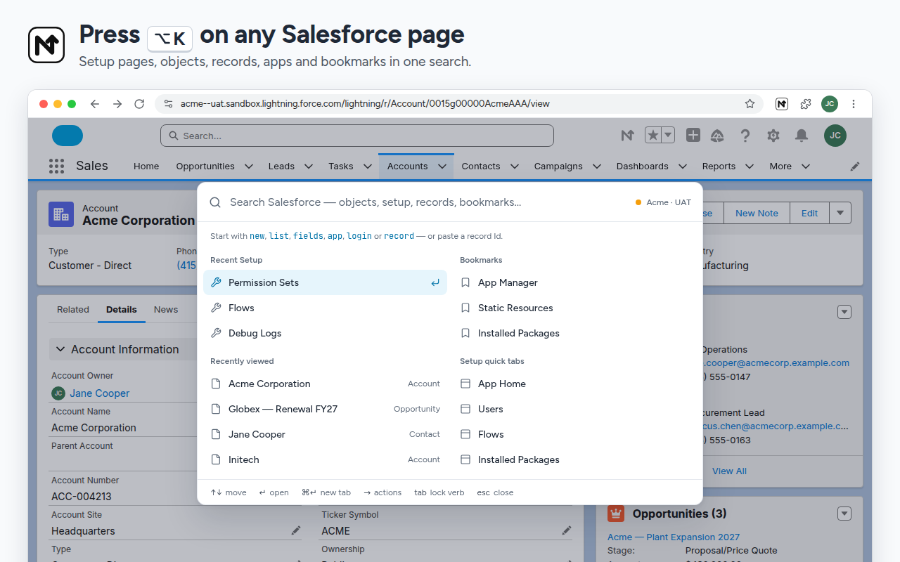

# Navigator for Salesforce

Open any Salesforce Setup page, object, field, record, app or org in a few keystrokes.

  
  
  
  
  

**[Add to Chrome](https://chromewebstore.google.com/detail/navigator-for-salesforce/oiaghoidghokmelfojmlilhigihhmeba)**

Navigator used to be called **Salesforce Easy Navigator**. If you already have it, version 5.0 updated it in place under the new name.

## What it does

Press `Alt+K` (`Option+K` on a Mac) on any Salesforce page and start typing:

| Type | To |
| --- | --- |
| `users`, `perm` | Open any of 400+ Setup pages. `perm` finds Permission Sets. |
| `acme` | Find a record, user, object, profile, permission set, flow, app, Apex class or trigger, or custom metadata type named Acme |
| `new case`, `list lead` | Open a new Case, or the Leads list view |
| `fields account indus` | Jump to the Industry field on Account |
| `app service` | Open the Service Console app |
| `record` and a space | See the current record's field values, with API names, ready to copy |
| `org uat` | Open a saved org in a new tab, or press `→` to open the page you're on in that org |
| `login jane` | Log in as Jane, if you're allowed to log in as other users |

You can also paste a 15- or 18-character record Id. The closest match comes first. Press `Enter` to open it, `Ctrl/⌘+Enter` to open it in a new tab, or `→` for more actions, like **Login as** on a user.

**The popup** (`Alt+N`, or `Option+N` on a Mac) has four tabs:

- **Recent**: Setup pages you opened with Navigator, and records you viewed
- **Navigate**: Home, Setup, Object Manager, Dev Console, Flows, Users, change sets, and up to 10 bookmarks
- **Objects**: your org's objects, with list, new record and fields, and a menu for layouts, record types, validation rules and triggers. Objects from installed packages are hidden from the list until you turn them on (in Settings or under the list), but search always finds them
- **Orgs**: your saved orgs, with a colored dot for production, sandbox, scratch and developer orgs. Rename them, pin your favorites, open any of them in one click, or open the page you're on in another org

**On Salesforce pages**, Navigator adds a row of your own Setup quick tabs under the Setup header, and an **N** button in the header that opens the popup.

**Tab colors** (off by default): turn on **Settings → Orgs → Color browser tabs by org** and each saved org's browser tabs get a Salesforce cloud icon in the org's own color, with its initial in the middle. Production orgs get red first and show the initial in a circle. Only saved orgs are colored: on an org you haven't saved, the popup's Orgs tab offers to add it. Click a color in Settings to change it.

Everything can be turned on or off in Settings, along with the theme (light, dark or system) and import or export of your data.

## Keyboard shortcuts

| Windows / Linux | Mac | Action |
| --- | --- | --- |
| `Alt+K` | `Option+K` | Open the command palette |
| `Alt+N` | `Option+N` | Open the popup |
| `Alt+S` | `Option+S` | Go to Setup |
| `Alt+A` | `Option+A` | Go to the current app's Home |

Chrome skips a default shortcut that another extension already uses. You can change any of them at `chrome://extensions/shortcuts`.

## Install

Install it from the [Chrome Web Store](https://chromewebstore.google.com/detail/navigator-for-salesforce/oiaghoidghokmelfojmlilhigihhmeba).

To run it from source instead, see [CONTRIBUTING.md](CONTRIBUTING.md#run-it-locally).

Moving from an unpacked copy to the store version? Saved data doesn't carry over by itself. Export it from the old copy (**Settings → Data → Export**), then import it in the new one.

## Privacy

Navigator runs entirely in your browser. It talks only to the Salesforce org you're logged in to, using the session you already have, and sends nothing anywhere else. There are no analytics, no ads and no accounts.

| Permission | Why |
| --- | --- |
| `storage` | Saves your bookmarks, quick tabs, orgs, tab colors and settings, synced through your Chrome profile |
| `cookies` | Reads your Salesforce session to make read-only API calls to your own org, and to see which orgs you're logged in to |
| Salesforce sites only | Runs on `*.force.com`, `*.my.salesforce.com` and `*.my.salesforce-setup.com`, nowhere else |

Searching records, objects and other org data is on by default. To turn it off, open Settings and switch off **Load data from your org**.

For full details, see the [privacy policy](PRIVACY.md). To report a security problem, see [SECURITY.md](SECURITY.md).

## Contributing

Bug reports, ideas and pull requests are welcome. There's no build step and there are no dependencies: clone the repo, load it unpacked and run `npm test`. [CONTRIBUTING.md](CONTRIBUTING.md) explains how.

## License

[MIT](LICENSE). Icons and fonts are credited in [THIRD_PARTY_NOTICES.md](THIRD_PARTY_NOTICES.md).

Navigator for Salesforce is an independent project. It isn't affiliated with or endorsed by Salesforce, Inc. Salesforce and Lightning are trademarks of Salesforce, Inc.

Made by **Shakhawat Hossain**: [GitHub](https://github.com/shawon39) · [LinkedIn](https://www.linkedin.com/in/shawon39)
